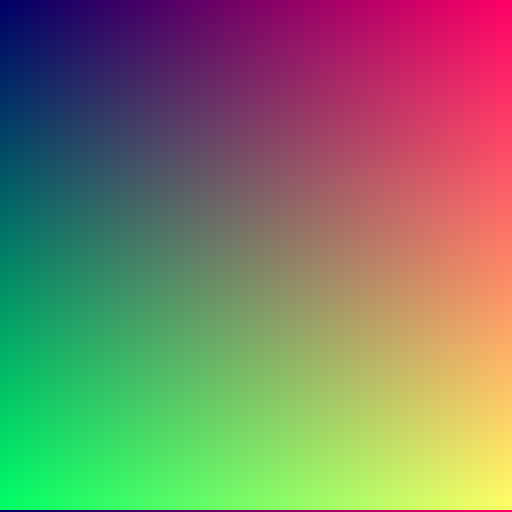
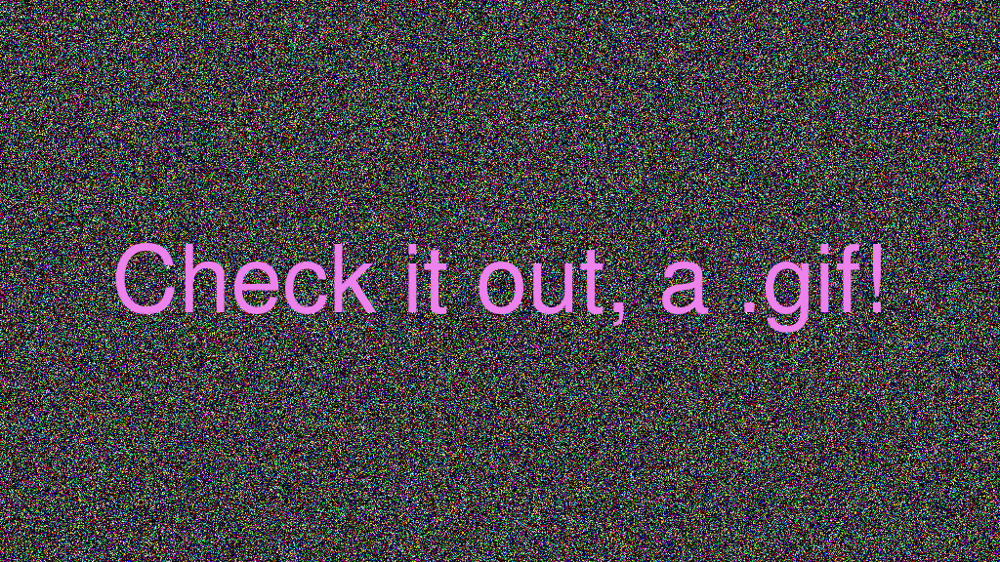
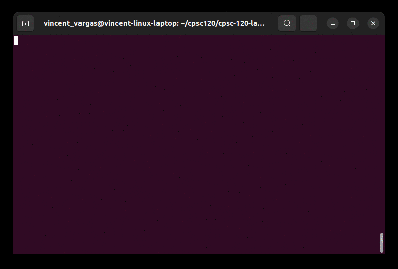

# Hello World!

This is my home page! My name is Vincent Vargas and I am a Student at [Cal State Fullerton](http://fullerton.edu/) and my major is Psychology

## Computer Science Projects 

My GitHub Page is https://github.com/Vincent-Vargas.

### CPSC 120 

* Lab 8

    Lab 8 was one of my favorite labs because it was fun to interact with the files. Part 1 and 2, 
    while simple, were good examples of using C++ to read and make text files. In part 3, It was fun
    to see animations being played, such as the firework and Godzilla vs Bambi animations. 

* Lab 12
    
    Lab 12 was my second favorite lab since I was able to experiment with the values to create several
    images. The gif in part 1 was intertesting to oberseve after realizing we were using radian values 
    to make animations. Part 2 was fun since we were able to input our own messages.

* Lab 11

    Lab 11 was my favorite lab out all the ones we've done this semester. While part 1 taught me about
    how constructors work, it was part 2 that made me enjoy it. Part 2 showed me how far I've come in this class,
    as this finally allowed us to make a hi-lo game code with both random numbers and the ability for two 
    players to play. What started out with only simple cout and cin lines became a more complex piece of code with 
    random numbers, constructors, and more than one file.

**Two custom files I made:**

* A custom Gradient image from Lab 10

* A custom noise .gif from Lab 12

**The Guessing Game code in action**

